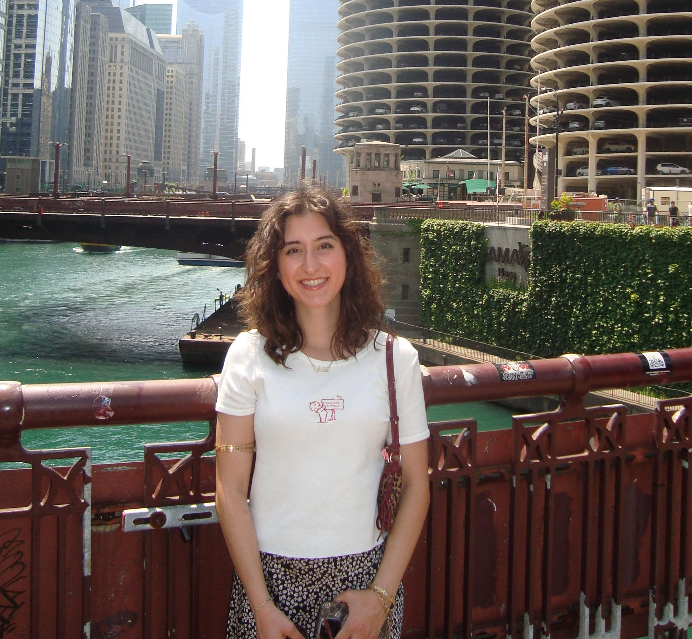

::: {style="text-align: center;"}

:::

------------------------------------------------------------------------

------------------------------------------------------------------------

:::: {#linkedin-button}
::: {style="
background-color: #9fb89f; color: white; padding: 12px; text-align: center; border-radius: 8px; width: 200px; margin: 20px auto; font-size: 1.1em; font-weight: 600; line-height: 1; "} <a href="https://www.linkedin.com/in/comelia-soltanirad"
     target="_blank"
     style="color: white; text-decoration: none;"> LinkedIn </a>
:::
::::

------------------------------------------------------------------------

Hi! My name is Comelia Soltanirad and I am a Master's student in Biostatistics at Case Western Reserve University. I graduated from the Ohio State University in May 2025 after earning my degree in chemistry.

My academic and research journey has included work at the OSU Comprehensive Cancer Center, where I studied metabolic regulation in disease using mouse models and 3D organoid systems, as well as research in AI-enhanced chemistry education that led to a published study comparing generative AI performance to student work.

At Ohio State, I stayed engaged on campus through several roles, including serving in the Sustainability Committee within the Undergraduate Student Governent, working as a barista at the campus cafe, and training clients as a certified personal trainer. These experiences strengthened my communication, leadership, and time management skills in a variety of settings.

I am passionate about science and research, and I am excited to combine my applied science background with my growing skills in coding and data analysis.

If you’d like to connect, feel free to reach me at **css140\@case.edu**, or connect with me on LinkedIn.
